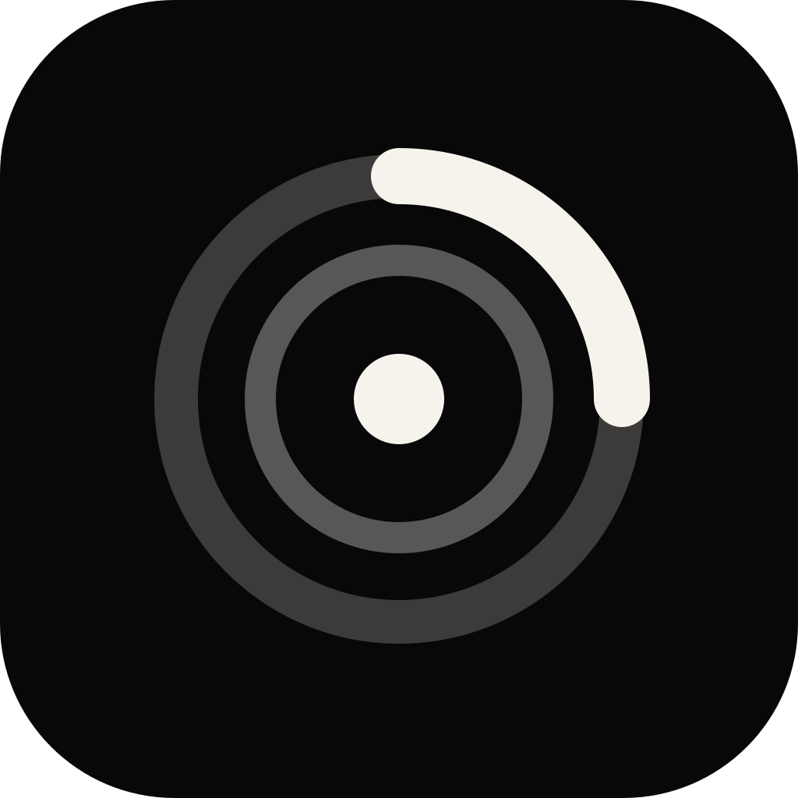

# Timebox Mark



Timebox Mark is an app-first timeboxing planner built with Flutter and a native iOS Live Activity integration. The project focuses on one hard product problem: turning a daily timeboxed plan into an executable timer, notification, Live Activity, and calendar workflow.

The product direction is inspired by explicit timeboxing: brain dump, top three priorities, time box grid, focus execution, and review.

## Highlights

- Flutter UI with Riverpod state management
- Native iOS timer source of truth through `MethodChannel`
- ActivityKit Live Activity for Lock Screen and Dynamic Island
- Top priorities and current time box metadata in Live Activity
- Native start/progress and completion notifications with current task metadata
- Session presets: `25/5`, `50/10`, and `15/3`
- Configurable time box planning intervals: 15, 30, or 60 minutes
- Auto-start options for breaks and next focus sessions
- Local alert and sound preferences
- Cold-launch restoration using persisted native `endTime`
- Local Today Plan persistence and seven-day daily history
- UID-scoped plan storage that preserves daily plans across sign-in changes
- Apple Calendar export through EventKit
- Google Calendar export through Google Sign-In and a Dio REST client
- Firebase Auth gate with Apple, Google, and email sign-in and account deletion
- Crashlytics fatal/non-fatal monitoring with lifecycle and timer breadcrumbs
- Android foreground timer with OS-rendered countdown notifications
- Melos workspace scripts for codegen, testing, guardrails, and release checks
- Mockito repository/data-source tests and a Patrol first-launch smoke test
- Signed Codemagic and Fastlane store pipelines with store screenshot automation
- Branded public support and legal site served from `public/` on Firebase Hosting
- Monotone visual system and custom SVG-based app icon
- Notebook capture and multi-calendar sync roadmap for later expansion

## Why This Project Matters

Flutter does not provide first-party Live Activity support. This app demonstrates how to bridge a Flutter product surface with iOS-only system experiences without a plugin dependency:

```text
Flutter UI / Riverpod
        |
        | MethodChannel
        v
Swift PomodoroTimerManager
        |
        +-- UserNotifications
        +-- ActivityKit Live Activity
```

The native timer owns the authoritative `endTime`. Flutter receives tick updates for the in-app display, while Live Activity renders from the same absolute timestamp. When the app process is killed and reopened, Flutter asks native code to restore the active session instead of resetting to `25:00`.

Android follows the same absolute-time architecture. Flutter synchronizes the
Today schedule to native storage, and a Kotlin foreground service selects the
current/next card from persisted start and end timestamps. Active countdowns
use notification Chronometer fields, so the app does not repost a notification
every second. Android 16 progress-centric Live Updates remain a separate
presentation enhancement.

## Product Decisions

The feature set is intentionally small and portfolio-friendly:

- `25/5` classic Pomodoro reflects the common work/break pattern.
- `50/10` supports deeper work blocks.
- `15/3` supports quick starts when motivation is low.
- Auto-start breaks are enabled by default to protect recovery time.
- Auto-start scheduled focus is off by default; when enabled, the current and
  following time boxes start from their clock-aligned remaining time.
- The time box grid interval is a setting (`15`, `30`, or `60` minutes, default
  `30`) so plans can match how granular the user actually schedules.
- Email/password sign-in exists alongside Apple and Google so store reviewers
  can reach the full experience without a third-party account.
- Local alerts can be disabled independently from Live Activity.
- Alert sound can be disabled while keeping visual notifications.
- Notification permission is requested contextually when the user starts a timer, not on first launch.
- Live Activity stays glanceable: top priorities, current time box, remaining time, and progress.
- Focus and break segments reuse one Live Activity. Segment-specific values such
  as `endTime`, phase, title, and total duration are updated through
  `ContentState` instead of ending and recreating the system activity.
- Running scheduled focus sessions reconcile against the wall clock after an
  active time box edit and whenever the app returns to the foreground. This
  keeps the in-app Focus UI, native timer, and existing Live Activity aligned.

## Product Roadmap

- [Product TODO](docs/product/TODO.md)
- [Current maintenance status](docs/maintenance/PROJECT_STATUS.md)
- [Crash monitoring and alert policy](docs/maintenance/CRASH_MONITORING.md)
- [Menu structure](docs/product/MENU_STRUCTURE.md)
- [Naming direction](docs/product/NAMING.md)
- [Timeboxing strategy](docs/product/TIMEBOXING_STRATEGY.md)
- [Notifications and calendar plan](docs/product/NOTIFICATIONS_AND_CALENDAR.md)
- [Android timer notification strategy](docs/product/ANDROID_TIMER_NOTIFICATION_STRATEGY.md)
- [Tech stack usage](docs/product/TECH_STACK_USAGE.md)
- [Daily plan data lifecycle](docs/architecture/DATA_LIFECYCLE.md)
- [App Store review preparation](docs/release/APP_STORE_REVIEW_PREP.md)
- [Account ownership migration](docs/release/ACCOUNT_OWNERSHIP_MIGRATION.md)
- [App Store, Shorebird, and Codemagic setup](docs/release/APPSTORE_SHOREBIRD_CODEMAGIC_SETUP.md)
- [Release automation](docs/release/RELEASE_AUTOMATION.md)
- [Testing automation](docs/release/TESTING_AUTOMATION.md)
- [Shorebird policy](docs/release/SHOREBIRD_POLICY.md)
- [Environment strategy](docs/release/ENVIRONMENT_STRATEGY.md)
- [App Store assets](docs/store/APP_STORE_ASSETS.md)
- [Google Play assets](docs/store/GOOGLE_PLAY_ASSETS.md)
- [Privacy policy draft](docs/legal/PRIVACY_POLICY_DRAFT.md)
- [Terms draft](docs/legal/TERMS_DRAFT.md)

References used while shaping the product:

- [Apple Human Interface Guidelines: Live Activities](https://developer.apple.com/design/human-interface-guidelines/live-activities/)
- [Apple ActivityKit documentation](https://developer.apple.com/documentation/activitykit/displaying-live-data-with-live-activities)
- [Todoist: Pomodoro Technique](https://www.todoist.com/productivity-methods/pomodoro-technique)
- [Pomofocus](https://pomofocus.io/)

## Architecture

The codebase follows a feature-first structure. Each feature uses the
`data`, `domain`, and `presentation` layers it needs. Riverpod controllers live
under `presentation/controllers`. The optional `di` directory is not an
additional application layer; it is the composition point that connects data
implementations, domain use cases, and presentation controllers.

```text
lib/
  features/
    focus/
      data/
        datasources/
        dtos/
        repositories/
      domain/
        entities/
        repositories/
        usecases/
      presentation/
        controllers/
          pomodoro_controller.dart
        widgets/
      di/
        focus_providers.dart
    today/
      presentation/
        controllers/
          today_ui_controller.dart
        widgets/
    calendar/
      data/
      domain/
      presentation/
        controllers/
      di/
        calendar_providers.dart
    settings/
      domain/
      presentation/
        controllers/
    onboarding/
      presentation/
        controllers/
    shell/
      presentation/
        controllers/

ios/
  Runner/
    AppDelegate.swift
    PomodoroTimerManager.swift
    PomodoroActivityAttributes.swift
  PomodoroWidgetExtension/
    PomodoroWidgetLiveActivity.swift
    PomodoroActivityAttributes.swift
```

## Timer Lifecycle

1. User starts a focus or break segment.
2. Flutter calls native `startTimer(seconds, phase, sessionGoal)` through MethodChannel.
3. Swift persists `endTime`, phase, session count, pause state, and goal.
4. Swift schedules a completion notification and starts/updates Live Activity.
5. Native sends `onTick` events to Flutter while the app process is alive.
6. On foreground/cold launch, Flutter calls `restoreState`.
7. Swift recomputes remaining time from `endTime - now` and reconnects to any active Live Activity.
8. Flutter compares the daily schedule with the current wall clock and moves to
   the currently active time box instead of replaying every missed callback.

The current binary uses absolute timestamps, persistence, local notification,
and foreground reconciliation as its cross-version foundation. ActivityKit
push tokens are registered under the signed-in account, and a scheduled Cloud
Function can send APNs updates to the existing Live Activity while Flutter is
suspended. If a token or network path is unavailable, the system-rendered
countdown remains correct from `endTime`, and foreground reconciliation catches
the metadata up when the app becomes active again.

## Daily Plan Data Lifecycle

Today Plan data is scoped by `Firebase UID + local date` in the local cache and
mirrored to `users/{uid}/days/{yyyy-MM-dd}` in Firestore. On startup the app
resolves local and cloud revisions before accepting writes, so the default
empty entity can never overwrite a saved plan while restoration is pending.
Because every local key carries the owning UID, signing out, switching
accounts, or deleting an account cannot mix or lose another account's plans.
Native timer restoration only touches runtime fields and never replaces daily
content. See [DATA_LIFECYCLE.md](docs/architecture/DATA_LIFECYCLE.md) for the
full rules.

## Live Activity Notes

Live Activity uses SwiftUI `Text(timerInterval:countsDown:)`. On the Lock Screen or in Simulator, iOS may temporarily show minute-level placeholders such as `19:--` while throttling second-level rendering. The underlying timer still uses the persisted absolute `endTime`, so this is a display policy rather than a state-sync bug.

A Pomodoro session owns one Live Activity. Starting the next focus or break
segment updates the existing activity's dynamic `ContentState`, while an
explicit stop ends it. This avoids an asynchronous end/request race, duplicate
activities after process restoration, and visible Dynamic Island churn between
segments.

## Android Timer Notes

Android has a parallel constraint: notification updates can be rate-limited or delayed by the system, and OEM battery management can affect persistent notification freshness. The implemented Kotlin foreground service passes the end time into an ongoing notification and lets Android render time through `setWhen`, `setUsesChronometer`, and `setChronometerCountDown`. It also persists the daily card schedule and advances contiguous cards without depending on a running Dart isolate. See [Android timer notification strategy](docs/product/ANDROID_TIMER_NOTIFICATION_STRATEGY.md) for the verified flow and current limitations. Android 16 Live Updates can later add `Notification.ProgressStyle` for supported progress-centric surfaces.

## Local Setup

```bash
flutter pub get
dart run melos run codegen
dart run melos run analyze
dart run melos run test
dart run melos run guard
flutter build ios --simulator
```

The app target currently requires iOS 15.0+ because Firebase Auth/Core Swift Package products require that minimum. For Live Activity testing, use iOS 16.1+ and preferably a physical device.

## Firebase And Calendar Setup

Firebase config files are intentionally local-only for the public repository.
Run `flutterfire configure` with your own Firebase project before building auth
or cloud sync features.

Completed:

1. Firebase project created locally
2. iOS Firebase app registered locally for the app bundle
3. `ios/Runner/GoogleService-Info.plist` generated locally and ignored by git
4. `lib/firebase_options.dart` generated locally and ignored by git
5. Identity Toolkit API enabled for Firebase Auth
6. Google Calendar API enabled
7. Apple, Google, and Email/Password Firebase Authentication providers enabled
8. Google Sign-In URL scheme is read from local `ios/Flutter/Firebase.local.xcconfig`
9. Settings account UI supports Apple and Google Firebase sign-in
10. Firestore sync stores each signed-in user's Today Plan at `users/{uid}/days/{yyyy-MM-dd}`
11. Local Today Plan records upload to Firestore after sign-in when no cloud record exists
12. Daily history merges local summaries with Firestore summaries for the signed-in user
13. Account deletion returns immediately to the auth gate and clears local plan data after the Firebase account is deleted
14. Crashlytics and Analytics collect release-only stability signals without account IDs or user-entered plan text

Still required in Firebase, Google Cloud, and Apple Developer consoles:

1. Enable Sign in with Apple for the Apple Developer App ID and keep `Runner/Runner.entitlements` attached to the Runner target.
2. Create ignored `ios/Flutter/Firebase.local.xcconfig` and set `GOOGLE_REVERSED_CLIENT_ID` from your Firebase iOS app.
3. Configure the OAuth consent screen for Calendar event write access.
4. Add release/test users while the OAuth consent screen is in testing mode.

Firestore rules in this repo restrict plan records to the authenticated owner:

```text
users/{uid}/days/{yyyy-MM-dd}
```

## Deployment Checklist

Public release URLs:

- Privacy Policy: https://timebox-mark-prod.web.app/privacy/
- Support: https://timebox-mark-prod.web.app/support/
- Terms: https://timebox-mark-prod.web.app/terms/

The site source lives in `public/` (branded landing, privacy, support, and
terms pages) and deploys through Firebase Hosting.

Release automation:

- Fastlane: `ios/fastlane` with `verify`, `build_ipa`, `internal_beta`, and `metadata` lanes
- Codemagic: `codemagic.yaml` — fetches signing files through the App Store Connect API, installs the FlutterFire CLI, derives the next iOS build number from the latest TestFlight build, and archives with generated export options
- CircleCI: `.circleci/config.yml`
- Public-repo guardrails: `scripts/ci/verify_release_guardrails.sh` (works with or without ripgrep on the runner)
- Store screenshots: `integration_test/app_store_screenshot_test.dart` and the `test_driver/` workflows capture App Store and Google Play assets
- Shorebird: initialized for compatible Dart-only patches after a normal signed
  binary release; native, ActivityKit, entitlement, and permission changes
  always use the TestFlight/App Store binary workflow

The first verified OTA path used TestFlight/Shorebird release `1.0.0+9` and a
Dart-only Today UI patch. The patch improved full-card dragging, trash-target
visibility, compact 15-minute cards, and automatic tracking for newly created
cards without changing native code.

1. Open `ios/Runner.xcworkspace` in Xcode.
2. Set a valid Apple Developer Team for `Runner` and `PomodoroWidgetExtensionExtension`.
3. Confirm the bundle IDs are available in your Apple Developer account:
   - `com.seongwoo.focusmark`
   - `com.seongwoo.focusmark.PomodoroWidgetExtension`
4. Enable Live Activities support for the app target.
5. App icons are exported without an alpha channel to satisfy App Store validation.
6. Build an archive from Xcode or run:

```bash
flutter build ipa --release
```

If the bundle ID is already taken, replace `com.seongwoo.focusmark` with your own reverse-DNS identifier in Xcode.

## Verification

Current verified commands:

```bash
flutter gen-l10n
dart run build_runner build
flutter analyze
flutter test
flutter build ios --simulator
./gradlew :app:assembleDebug
```

The Bridle quick gate covers secret scanning across the worktree and Git
history, duplicate implementation detection, analysis, and the Flutter test
suite. The Flutter gate (`gates/flutter_check.sh`, mirrored in the
`flutter_gate` GitHub workflow) is reproducible: it exits with a distinct code
when the toolchain is missing instead of passing silently, and it fails when
generated code (`*.g.dart`, `*.freezed.dart`, `*.mocks.dart`, generated l10n)
drifts from its sources.

The iOS release archive requires local Apple signing credentials, so final App Store/TestFlight export should be performed on the developer account that owns the bundle ID.

See `docs/release/TESTFLIGHT_UPLOAD.md` for the exact TestFlight upload runbook.
